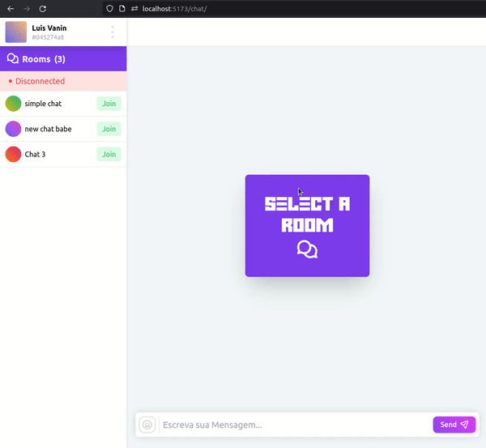

# Py Chat

## Descrição do Projeto 📄

O Py chat é uma plataforma de bate-papo em tempo real que utiliza a tecnologia websocket para garantir alta performance e interação instantânea entre os usuários. Desenvolvido com as linguagens Python e Typescript, o Py chat oferece uma experiência fluida e intuitiva para quem busca um ambiente virtual de comunicação eficiente.

## Preview 📷

<p align="center">

</p>

<br />

## Como rodar o projeto 🚀

### Pré-requisitos

Antes de começar, você vai precisar ter instalado em sua máquina as seguintes ferramentas:

-   [Git](https://git-scm.com)
-   Python
-   Mongo DB
-   npm

Também é necessário configurar as suas variáveis de ambiente de acordo com o arquivo [.env.example](/.env.example).

### Rodando o Back End (servidor) 🎲

```bash
# Clone este repositório
$ git clone <repo-url>
```

Tendo o banco de dados Mongo Db já instalado e rodando, execute o seguinte comando para instalar as dependências do projeto:

```bash
# Instale as dependências
$ pip install -r requirements.txt
# Rode o servidor na porta 3000 usando uvicorn(instalado com o comando acima)
$ uvicorn main:app --port 3000
# OU
$ python main.py
```

### Rodando a aplicação web (Front End) 🧭

Para rodar essa parte também será necessário configurar o .env dentro da pasta [web/](/web/). Após isso basta rodar os scripts abaixo:

```bash
# Entre na pasta web
$ cd web
# Instale as dependências
$ npm install
# Rode o servidor de desenvolvimento
$ npm run dev
```

### Rodando usando Docker 🐳

WIP 🚧

## Ferramentas Utilizadas 🛠️

<p align="center">

</p>

## Entre em contato 📞

<p align="center">
<a href="https://www.linkedin.com/in/luis-felipe-vanin-martins-5a5b38215">

</a>
<a href="mailto:luisfvanin2@gmail.com">

</a>
</p>
